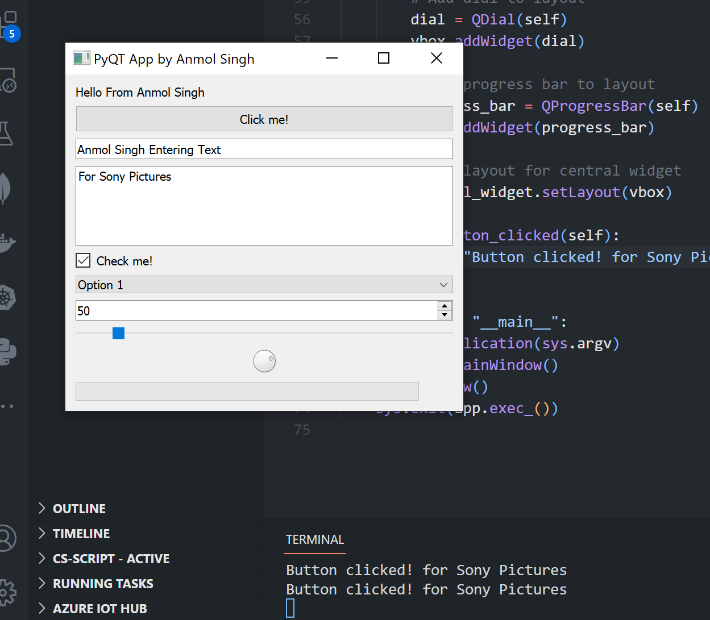

# PyQT-project

## PyQT Application

This is an application written in PyQT5 that demonstrates the use of various UI elements, including labels, buttons, text and line edits, checkboxes, combo boxes, spin boxes, sliders, dials, and progress bars.

To run this application, follow these steps:

1. Install PyQT5 by running `pip install PyQt5` in your command prompt or terminal.
2. Save the code in the file `pyqt_example.py`.
3. Open a command prompt or terminal and navigate to the directory where the `pyqt_example.py` file is saved.
4. Run the command `python pyqt_example.py` to execute the file.
5. The PyQT5 application window will appear on your screen with the UI elements created by the program.
